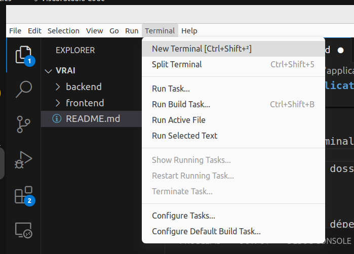

# Setup de l'application

## Frontend

Rien à faire, tout est dejà bon

## Backend
1. Ouvrir un terminal (Sur Vscode aller dans Terminal -> New Terminal)

2. Aller dans le dossier `backend/`
```bash
cd backend/
```
3. installer les dépendances
```bash
npm install
```
4. Lancer le serveur Backend
```bash
node server.js
```